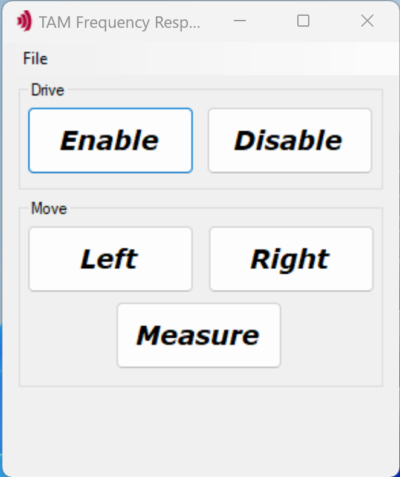

# Frequency Response Automation

[](https://www.triamec.com/en/tam-api.html)

Minimal example on how to use the TAM API to automate the frequency response measurement.

This application was built on the [Hello World! Example](https://github.com/Triamec/HelloWorld).



## Hardware Prerequisites

To record a Frequency Response of an axis, you need a *Triamec* drive with a motor and encoder connected and configured. If you want to do the measurement at a specific position, in Closed Loop or with a back and forth move running, you also need a stable position controller. Connect the drive by *Tria-Link*, *USB* or *Ethernet*.

## Software Prerequisites

This project is made and built with [Microsoft Visual Studio](https://visualstudio.microsoft.com/en/).

In addition you need [TAM Software](https://www.triamec.com/en/tam-software-support.html) installation.

## Run the *Frequency Response Automation* Application

1. Open the `Frequency Response Automation.sln`.
2. Open the `Frequency Response Automation.cs` (view code)
3. Set the name of the axis for `AxisName`. Double check it in the register *Axes[].Information.AxisName* using the *TAM System Explorer*.
4. Adjust all parameters needed for the Frequency Response Measurement like you would in the Frequency Response Tool within the *TAM System Explorer*
```csharp
        const int MeasurementFrequency = 100000; // [Hz]
        const int MinimumFrequency = 300; // [Hz]
        const int MaximumFrequency = 400; // [Hz]
        const int NumberOfSamples = 3; // [-]
        static readonly FrequencySpacing FrequencySpacing = FrequencySpacing.Optimized;
        const string SelectedMethod = "Closed Loop";
        static readonly double[] ExcitationLimits = new double[] { 13.8, 0.5, 0.5 };
```
   
6. Additionally to these parameters, you can also configure if you want to execute a back and forth move during measurement. This can for example be helpful if you want to minimize effects of friction on the measurement. Make sure the axis has enough room to move for the configured value `BackAndForthDistance` and a choose a low value for `BackAndForthVelocity`.
7. Adjust the positions where you want to measure the Frequency Response with `MeasurementPositions`.
8. Now make sure the *TAM System Explorer* is not connected to the drive, or simply close it. This is not necessary if you are connected to the drive via Ethernet, where multiple connections are possible.
9. Start the application.

## Operate the *Frequency Response Automation* Application

Press **Enable** to activate the axis.

```csharp
void EnableDrive() {

    // Set the drive operational, i.e. switch the power section on.
    _axis.Drive.SwitchOn();

    // Reset any axis error and enable the axis controller.
    _axis.Control(AxisControlCommands.ResetErrorAndEnable);
}
```

Press **Left** and **Right**. The motor moves the `Distance` value in the corresponding direction. Both buttons trigger the same method. Change the speed with the slider.

```csharp
void MoveAxis(int sign) =>

    // Move a distance with dedicated velocity.
    // If the axis is just moving, it is reprogrammed with this command.
    _axis.MoveRelative(Math.Sign(sign) * Distance);
```

Press **Disable** to switch off the axis.

```csharp
void DisableDrive() {

    // Disable the axis controller.
    _axis.Control(AxisControlCommands.Disable);

    // Switch the power section off.
    _axis.Drive.SwitchOff();
}
```
Press **Measure** to start a Frequency Response measurement. The executed measurements will by default be saved to `FrequencyResponseAutomation\Frequency Response Automation\bin\Debug\net48\Frequency Response`
```csharp
      async void OnMeasureButtonClick(object sender, EventArgs e) {
            try {
                _measureButton.Enabled = false;

                for (int i = 0; i < MeasurementPositions.Length; i++) {
                    CancellationTokenSource cts = new CancellationTokenSource();
                    CancellationToken cancellationToken = cts.Token;

                    await _axis.MoveAbsolute(MeasurementPositions[i], MoveToPositionVelocity).WaitForSuccessAsync(TimeSpan.FromSeconds(10));

                    Task moveTask;
                    if (DoBackAndForthMove) {
                        if (SelectedMethod == "Closed Loop") {
                            moveTask = MoveBackAndForth(cancellationToken, BackAndForthDistance, BackAndForthVelocity);
                        } else {
                            throw new Exception("Back and Forth move is only possible in Closed Loop");
                        }
                    } else {
                        moveTask = null;
                    }
                    Task measureTask = Measure();

                    await measureTask;
                    cts.Cancel();
                    await _axis.Stop(false).WaitForSuccessAsync(TimeSpan.FromSeconds(10));
                    if (moveTask != null) {
                        await moveTask;
                    }
                }

            } catch (TamException ex) {
                MessageBox.Show(ex.Message, Resources.MoveErrorCaption, MessageBoxButtons.OK,
                    MessageBoxIcon.Information, MessageBoxDefaultButton.Button1, 0);
            } finally {
                _measureButton.Enabled = true;
            }
        }
```
